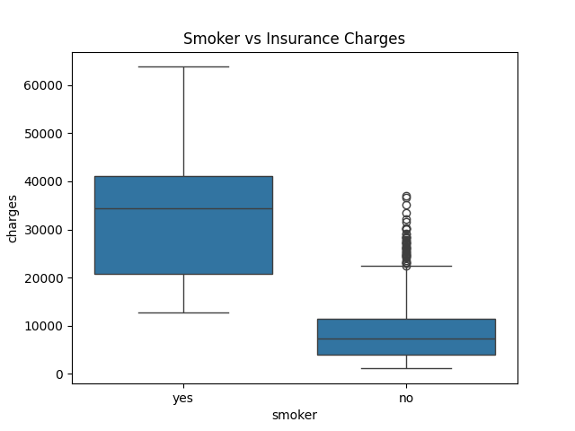
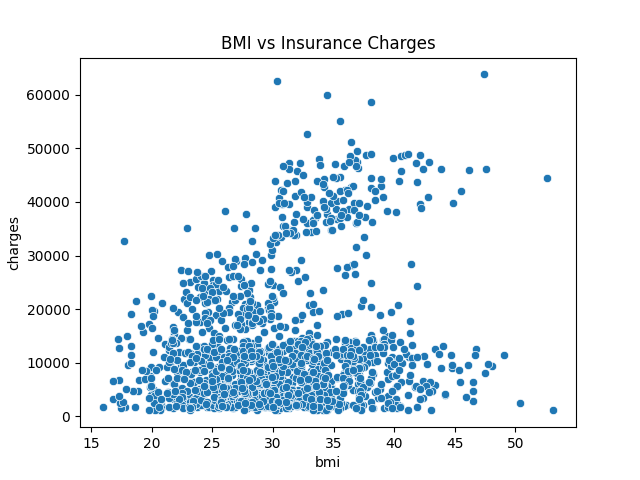
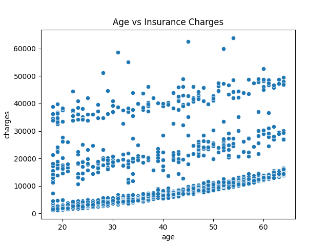

# Predicting Insurance Claim Amounts

A beginner data science project built during my Data Science & Analytics Internship at DevelopersHub Corporation. The goal is to predict how much a person will be charged for medical insurance based on their personal data, using Linear Regression.

---

## Dataset

**Medical Cost Personal Dataset** - available on [Kaggle](https://www.kaggle.com/datasets/mirichoi0218/insurance)

| Column | Description |
|--------|-------------|
| age | Age of the person |
| sex | Male or Female |
| bmi | Body Mass Index |
| children | Number of dependents |
| smoker | Yes or No |
| region | US region (northeast / northwest / southeast / southwest) |
| **charges** | **Annual insurance cost - this is what we predict** |

1,338 rows. No missing values.

---

## What I Did

1. Loaded and explored the dataset using pandas checked shape, data types, and basic statistics
2. **Visualized key features:**
   - Box plot: Smoker vs Charges - smokers pay significantly more
   - Scatter plot: BMI vs Charges - higher BMI tends to mean higher cost
   - Scatter plot: Age vs Charges - older people pay more
3. Encoded categorical columns (sex, smoker, region) using One-Hot Encoding so the model can process them
4. Split the data 80% for training, 20% for testing
5. Trained a Linear Regression model using scikit-learn
6. Evaluated the model using MAE and RMSE

---

## Results

| Metric | Value |
|--------|-------|
| MAE | $4,181.19 |
| RMSE | $5,796.28 |

The model is off by about $4,181 on average. Smoking status turned out to be the strongest predictor of insurance charges.

---

## Key Findings

- Smokers pay roughly 3 - 4x more than non-smokers
- Age has a clear positive relationship with charges
- BMI combined with smoking creates the highest-cost group
- Region and sex have relatively small effects on charges

---

## Visualizations







---

## Libraries Used

- pandas
- seaborn
- matplotlib
- scikit-learn
- numpy

---

## How to Run

1. Download `insurance.csv` from [Kaggle](https://www.kaggle.com/datasets/mirichoi0218/insurance)
2. Place it in the same folder as the notebook
3. Install dependencies:
```
pip install pandas seaborn matplotlib scikit-learn numpy jupyter
```
4. Open and run `task4_insurpred.ipynb`

---

## Author

**Muhammad Kumail Haider**  
[GitHub](https://github.com/kumailhyderm) · [LinkedIn](https://linkedin.com/in/kumailhyderm)

---

## License

This project is open-source under the [MIT License](LICENSE).


*This project was completed as part of the DevelopersHub Corporation Data Science & Analytics Internship.*
